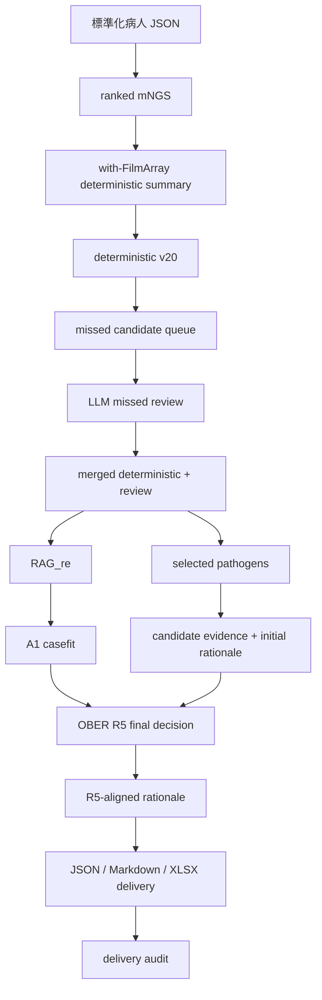

# Multimodal-Diagnosis-Model

此模型是一套從「標準化病人 JSON」整理 mNGS 候選菌、整合病例證據、執行 deterministic v20 與 OBER R5 決策，最後輸出可追溯結果的研究 pipeline。

這個 repository 將原本分散的上游處理、RAG、casefit、clinical rules、rationale 與 delivery 程式整理在同一個專案中，並提供單一流程編排入口。編排器只負責驗證 input/output、呼叫現有階段程式與保存執行紀錄，不會在 main program 內重新實作選菌規則。

> 研究用途：輸出是計算結果與待複核候選，不是臨床診斷。正式使用前仍需臨床、資料治理與授權審查。

## 主要入口

| 入口 | 範圍 | 外部服務 |
|---|---|---|
| `run_deterministic_v20.py` | 標準化 JSON → ranked mNGS → with-FilmArray deterministic summary → v20 可能菌種 | 不需要 |
| `run_full_pipeline.py` | 標準化 JSON → v20 → missed review → RAG/casefit → R5 → rationale → audited delivery | OpenAI、PubMed；XLSX 另需 Node runtime |

若只需要 deterministic v20 的可能菌種，使用第一個入口。若要依完整流程圖產生 R5 最終選擇、理由與交付檔案，使用第二個入口。

## Pipeline



R5 finalizer 會載入 `RAG_re_clinical` 的 clinical rules/config；`RAG_re_clinical_pruning*` 是研究比較支線，不是每次主線的必要步驟。

## 輸入格式

每位病人的檔案可平放在同一個目錄：

```text
input/
  NGS_patient_3_admission_diagnosis.json
  NGS_patient_3_CBC.json
  NGS_patient_3_culture.json
  NGS_patient_3_filmarray.json
  NGS_patient_3_gm_test.json
  NGS_patient_3_image.json
  NGS_patient_3_other_lab.json
  NGS_patient_3_underlying.json
  NGS_patient_3_mNGS_grouped.json
```

也可使用 per-patient 目錄：

```text
input/
  NGS_patient_3_json/
    NGS_patient_3_*.json
  NGS_patient_8_json/
    NGS_patient_8_*.json
```

mNGS 資料可使用：

- `mNGS_grouped`
- `all_RK_NTC_microbes`
- 已建立的 ranked mNGS JSON

如果同一病人同時存在 grouped 與 all-RK/NTC 來源，必須透過 `source_kind` 明確指定，避免自動選錯資料。

更完整的欄位、病人 ID、日期與跨階段契約見 [`docs/DATA_CONTRACTS.md`](docs/DATA_CONTRACTS.md)。

## 安裝與環境

目前驗證環境為 Windows 與 Python 3.13。先建立獨立虛擬環境：

```powershell
python -m venv .venv
.\.venv\Scripts\python -m pip install -r requirements-audit.txt
```

Linux/macOS 的 Python 路徑為 `.venv/bin/python`，但目前尚未完成完整跨平台驗證。

完整付費流程還需要：

- `OPENAI_API_KEY`
- PubMed／模型服務的網路連線
- Node.js
- delivery XLSX 所需的 `@oai/artifact-tool` runtime

不要把 `.env`、API key 或真實病例資料加入 Git。

## Quick start：deterministic v20

不需要 API key：

```powershell
python -B run_deterministic_v20.py `
  --input-root C:\path\to\standardized_json `
  --output-root C:\path\to\new_deterministic_run `
  --source-kind auto
```

主要輸出：

```text
new_deterministic_run/
  patients/              每位病人的 staged input、summary 與完整 scorer output
  ranked_mngs.json       合併的 ranked mNGS
  final_results.json     每位病人的可能菌種與候選結果
  run_manifest.json      input/output path、SHA256 與執行模式
```

輸出目錄必須尚未存在；程式不會覆寫舊 run。若 `auto` 發現同一病人有兩種 mNGS source，請改用 `mngs_grouped` 或 `all_rk_ntc`。

## Quick start：完整流程

先複製並修改範例設定：

[`examples/full_pipeline_config.template.json`](examples/full_pipeline_config.template.json)

第一步只產生執行計畫，不建立 output、不連網、也不呼叫模型：

```powershell
python -B run_full_pipeline.py `
  --config examples\full_pipeline_config.template.json `
  --output-root C:\path\to\new_full_run `
  --plan
```

請確認：

- cohort 與病人清單正確；
- `input_root`、hospital、dataset、`source_kind` 正確；
- RAG、casefit、clinical config 與 rationale prompt 是預期版本；
- 外部模型、病人數與兩輪 rationale 的成本可以接受。

確認後移除 `--plan`：

```powershell
python -B run_full_pipeline.py `
  --config C:\path\to\private_full_pipeline_config.json `
  --output-root C:\path\to\new_full_run
```

完整入口依序執行既有 stage，並在每一步核對預期輸出。失敗時保留已完成內容並寫出 `run_failed.json`；全部完成才會建立：

```text
new_full_run/
  cohorts/                       每個 cohort 的 deterministic、merged、evidence、RAG、casefit
  08_initial_rationale_audit/    第一輪 rationale 結構審核
  09_r5_final_decisions/         R5 最終選擇與 provenance
  10_r5_rationale_runs/          與 R5 結果對齊的第二輪理由
  11_r5_accepted_rationales.json
  12_delivery/                   JSON、Markdown、XLSX 與 delivery manifest
  run_manifest.json              所有 stage、command、狀態與 SHA256
```

完整介面、外部依賴與兩階段 rationale 的說明見 [`docs/FULL_PIPELINE.md`](docs/FULL_PIPELINE.md)。

## 測試

執行離線測試：

```powershell
python -B scripts/check_offline.py --output C:\path\to\new_check_output
python -B scripts/verify_sources.py
```

目前公開候選範圍已通過：

- 319 個 Python 測試
- 8 個 Node 測試
- 382 個來源 manifest SHA256 核對
- 470 個 package manifest 項目核對

測試涵蓋格式處理、deterministic v20、RAG/clinical/casefit 規則、R5、rationale handoff、delivery model 與多 cohort 病人 ID 隔離。離線測試不會呼叫付費模型或 PubMed。

## 專案結構

```text
frontend/                              KH／兩院輸入整理與格式入口
upstream/                              clinical summary、mNGS ranking、v19/v20、missed review
RAG_re/                                文獻、mNGS 與院內證據模組
RAG_re_casefit/                        A1 文獻與病例適用性
RAG_re_clinical/                       clinical B/C/D rules
RAG_re_clinical_pruning*/              研究比較支線
mngs_candidate_evidence_pipeline_20260902/
                                       candidate evidence 與 rationale views
OBER_patient_delivery/                 R5 finalizer、理由對齊、delivery export/audit
LLM_test/direct_raw_benchmark/         Direct-Raw 對照研究
reference_versions/                    歷史／共同來源快照
examples/                              合成資料與設定範例
scripts/                               離線測試、來源驗證與 v19 replay
docs/                                  完整方法、契約、版本與驗證文件
```

## 版本與研究界線

- 現行 clinical summary 固定使用 with-FilmArray 路徑。
- `deterministic_mngs_max_scorer.py` 是現行 v20；v19 recovered scorer 另行保存供重播。
- 保存的 55 例 R5 決策已能以凍結中間產物重播，但這不代表可由任意原始 Excel/PPT 完整重建論文 run。
- `RAG_re`、`RAG_re_casefit`、`RAG_re_clinical` 是 OBER 現行程式仍沿用的 package 名稱，不代表目前使用舊版系統。
- `rag_re.skip_literature=true` 是明確的無文獻分支，不能視為完整 A/B/C 結果。
- rationale 是根據凍結選擇與病例證據生成的事後說明，不得反向改變選菌結果。
- 結構驗證通過不代表醫學內容已經過臨床專家確認。

## 文件

- [`docs/WORKFLOW.md`](docs/WORKFLOW.md)：完整研究流程與各程式責任
- [`docs/FULL_PIPELINE.md`](docs/FULL_PIPELINE.md)：單一完整入口與 stage handoff
- [`docs/DATA_CONTRACTS.md`](docs/DATA_CONTRACTS.md)：跨階段 JSON 與 identity 契約
- [`docs/ENVIRONMENT.md`](docs/ENVIRONMENT.md)：環境、外部服務與離線執行
- [`docs/VERSIONS.md`](docs/VERSIONS.md)：現況、歷史版本與保存結果
- [`docs/VALIDATION.md`](docs/VALIDATION.md)：已完成驗證及其證明範圍
- [`docs/PUBLICATION.md`](docs/PUBLICATION.md)：發布前仍需完成的事項
- [`CODE_CATALOG.csv`](CODE_CATALOG.csv)：逐檔程式、imports 與 CLI 索引
- [`SOURCE_MANIFEST.csv`](SOURCE_MANIFEST.csv)：研究來源與轉換狀態

## 資料安全與授權

Repository 只應包含程式、文件及經人工確認的合成範例。以下內容不得提交：

- 真實病例、病人對照與可識別資料
- gold labels 與私人 cohort manifest
- API 回覆、模型 cache 與執行輸出
- `.env`、API keys、credential、私人 config
- 未經授權的 Office/PDF/壓縮檔

目前尚未確認整個研究專案可採用的統一開源授權，因此沒有附加 MIT、Apache 或其他 LICENSE。取得共同作者與機構的授權前，GitHub repository 應保持 private。詳見 [`LICENSE_STATUS.md`](LICENSE_STATUS.md)。
