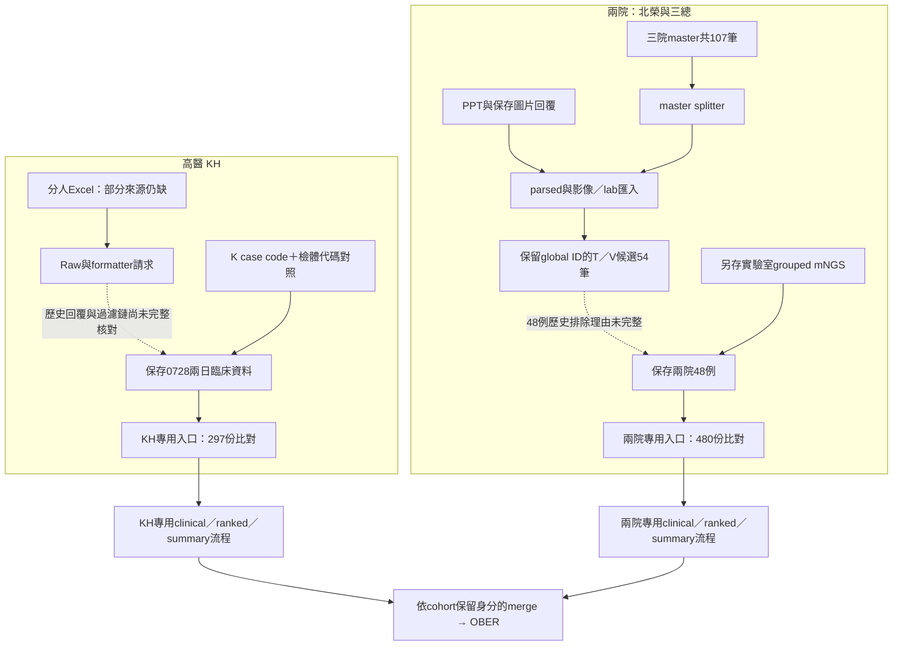

# 最前端研究流程：高醫與兩院

本repo依 **高醫（KH）** 與 **兩院（北榮、三總）** 整理最前端。Excel、PPT、Table 1 是主線內的輸入格式，不是三個互相替代的cohort。

先前把「107筆master格式重播成功」稱為「前端補齊」不夠準確，已修正。現在分別提供主線目錄、保存輸入整理入口、病例身分檢查、上游對照與各自的驗證界線。**兩條最原始資料到OBER的完整歷史生成鏈仍未全部重現。**

## 兩條主線與入口

| | 高醫 KH | 兩院：北榮、三總 |
|---|---|---|
| 主線目錄 | [frontend/kh](../frontend/kh/README.md) | [frontend/two_hospital](../frontend/two_hospital/README.md) |
| 臨床前端 | 分人多分頁Excel → Raw → formatter；現存0728兩日資料是明確的保存銜接點 | master Excel＋PPT → parsed／影像／lab匯入 → global patient export → 選定兩院病例 |
| mNGS | 依K case code＋檢體代碼配對global index；不能直接同號連接 | 另接保存的實驗室grouped資料；不以簡單master抽取替換 |
| 臨床ID namespace | `kmuh_case_code`：Pn對應Knnn | `legacy_global`：保留原global ID，只接受T／V case |
| 本次核對來源 | `0728_KH_filtter_data/KH_rawData_2Days`，33例 | `兩院資料_0611`，48例 |
| 對應保存上游 | `outputs/patient_info_KH_0728_2Days` | `outputs/patient_info_two_hospitals_0611`；另有rich/moderate版本 |
| 新入口 | `frontend/kh/run.py` | `frontend/two_hospital/run.py` |
| 本次分線比對 | 33×（8 clinical＋1 mNGS）＝**297/297份相同** | 48×（9 clinical＋1 grouped mNGS）＝**480/480份相同** |

新入口的operation明確為 `prepare_verified_snapshot`：驗證並複製已保存的輸入，輸出到新資料夾；不重新呼叫formatter、vision、clinical agent，也不宣稱重新生成summary／ranked／merge／OBER。這項驗證與下述最前端抽取證據分開記錄。



實線中的「比對／複製」不等於重新計算模型階段。兩條線可以共用程式，但不能共用同一個隱含病人編號空間或把資料合成一個未標cohort的目錄。

## 數量與選取範圍

| 範圍 | 高醫 | 兩院 | 含義 |
|---|---:|---:|---|
| 三院master索引 | K53 | T19＋V35＝54 | 107個檢體病例；不是55例交付 |
| 此次保存前端來源 | 33 | 48 | 本次分線整理與上游內容核對 |
| 保存rich/moderate root | 不適用 | 27 | 兩院的另一選取版本 |
| 目前OBER 55例交付 | 30 | 25 | 保存selected／merge的source hash核對結果 |
| Direct-Raw 41例比較 | 30 | 11 | 另一份凍結cohort manifest |

特別注意：25例兩院交付的summary來源為 **rich/moderate root 20例＋完整root 5例**，不是全部從27例root取出。入口把各subset清單分開保存，不根據病例數猜集合關係。

## 實際補上的身份防錯

- 專用入口拒絕另一主線的manifest與不相容namespace；K病例不能送進兩院。
- 每例同時固定clinical patient ID、master global ID、case code、specimen code，以及source index SHA256。
- KH按K case code驗證local ID；兩個master中有重複case code的情況，已用保存mNGS檢體代碼解開，33/33有唯一對照。
- 兩院維持原global ID，不從P1重新編號。來源檔名的` (1)`只能在明確hash指定後用於產生新輸出名，不就地改名。
- grouped mNGS有內容時，必須具有specimen record結構且檢體相符。flat RK/NTC候選不能冒充grouped。
- 兩院6例grouped為空：需明寫 `empty_explicit`，輸出標記只有index身分對照，不宣稱其mNGS內容已驗證。
- 所有來源與比較檔固定SHA256；拒絕缺檔、重複ID、未知subset病人與覆寫輸出。差異回傳非零狀態。

## 公開合成範例

在repo根目錄執行：

```powershell
python -B frontend/kh/run.py --manifest examples/frontend/cohorts/KH.synthetic.json --output local_outputs/kh_demo_001
python -B frontend/two_hospital/run.py --manifest examples/frontend/cohorts/two_hospital.synthetic.json --output local_outputs/two_demo_001
```

高醫範例刻意使用「clinical P3 → master P8」，兩院範例保留P54，驗證兩種身分規則真的不同。全部資料為人工合成；不含實際病例或模型回覆。

低階Excel／PPT抽取範例仍可執行：

```powershell
python -B frontend/pipeline.py --manifest examples/frontend/manifest.synthetic.json --output local_outputs/format_demo_001
```

它只驗證格式，不自動選定cohort。Table 1繼續作為補充格式；歷史baseline身分未明前不自動歸入高醫或兩院。完整格式參數移至 [FORMAT_PROCESSORS.md](FORMAT_PROCESSORS.md)。

## 保存輸入整理manifest

以合成manifest為完整範本。共用必填欄位為 `schema_version: "research_frontend.cohort.v1"`、`cohort`、`clinical_id_namespace`、`operation: "prepare_verified_snapshot"`、`source_boundary: "saved_clinical_and_mngs"`、`dataset_id`、`code_profile_sha256`、`source_index`、`cases`。

每個case含 `patient_id`、`master_patient_id`、`case_code`、`specimen_code`、`clinical`、`mngs_anchor`、`anchor_status`，可另加完整的 `expected_upstream` 比較參照。所有檔案使用 `{path, sha256}`，相對路徑以manifest為基準。`subsets`只列同一cohort已驗證的病例ID，且不會改動原病例編號。

輸出根下再分 `KH/` 或 `two_hospital/`，包含 `patient_info/`、`identity_mapping.private.json`、`files.private.json`、`subsets.private.json`、`upstream_comparison.private.json`。根目錄的 `receipt.private.json` 明記 `full_raw_to_ober_reproduced: false`、來源界線、比對數與空mNGS案例數。

## 先前重播結果的正確定位

- **1,070/1,070**：完整三院master格式輸出的107×10分項重播，不能當作兩條主線的端到端完成證明。
- 其中兩院48例的9類clinical可對到保存來源，**432/432相同**；grouped mNGS則42份不同、6份皆空。後續grouped來源要另外固定。
- **33份Excel**：33個來源路徑、25組不同內容、27個檔名病例標籤。只24個標籤覆蓋目前KH33例；9例在現有解壓縮檔中尚無同標籤Excel候選；已索引的15個壓縮檔Excel成員也無同標籤檔名命中，但不能據此排除另名檔案。即使標籤相同，也還要證明formatter／日期過濾歷史。
- 兩院來源中的flat `all_RK_NTC_microbes` 與上游同名grouped形式有47/48份不同，這不是單純檔名清理。入口保留grouped的明確角色，不偷換原始候選。

## 尚未確認的部分

1. KH缺失的原始Excel，以及Raw→formatter→0728兩日資料的完整歷史生成紀錄。
2. 三院master中的54個T／V病例如何選成48個交付病例的完整理由。
3. 42份較完整兩院grouped mNGS從更原始實驗室資料生成的完整recipe與當時版本；現存相符檔已固定，但尚非從零重算。
4. Table 1補充病例與baseline的歷史身分；正式論文cohort／run、上游模型、下游交付問題與授權仍見 [PUBLICATION.md](PUBLICATION.md)。

版本選擇依內容、明確身分對照與保存來源關係，不按檔名或修改日期。原始材料全部保留，私人manifest／病例／回覆／receipt不在公開候選repo。程式與檔案用途見 [COHORT_FILES.csv](COHORT_FILES.csv)，數據見 [COHORT_VALIDATION.json](COHORT_VALIDATION.json)。
