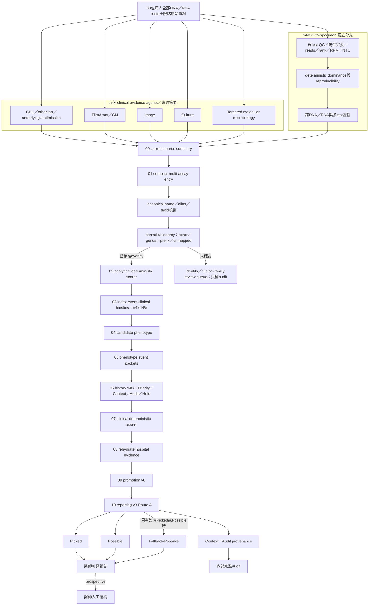

# KH 33 位新版完整 deterministic 流程（current F）

狀態：`2026-10-01_KH_ablation_F_current_full_v1` retrospective integrated release candidate。所有決策階段 answer-blind；答案只在流程完成後評估。

新版完整報告的陽性 endpoint 為：

> Picked＋Possible＋互斥 Fallback-Possible。

固定 30 位有答案病人、60 個答案、strict identity matching：TP 56、70 個被評估輸出、Precision 0.8000、Recall 0.9333、F1 0.8615。33 位全部病人合計 73 個醫師可見輸出，其中 3 個來自無 benchmark 答案的個案。公開 repository 不包含逐病人答案或結果。

## 1. 完整逐步流程圖

## 2. 程式實際執行順序

總入口：`tools/run_kh_integrated_release_v2.py`。

菌名標準化、alias／taxid、exact／genus／prefix／unmapped、雙 LLM review 與 deterministic validator 的完整細節，另見：[KH_ORGANISM_TAXONOMY_DETAILED_FLOW_V2_6_20261001_zh.md](KH_ORGANISM_TAXONOMY_DETAILED_FLOW_V2_6_20261001_zh.md)。

| # | 階段目錄 | 程式／政策 | 主要輸入 | 主要輸出與作用 |
|---:|---|---|---|---|
| 00 | `00_current_source_summary` | `tools/build_deterministic_summary.py` | 五個 clinical evidence sources、固定 33 位清單 | 目前院端 source summary；保存原始 evidence provenance |
| 01 | `01_compact_taxonomy` | `build_compact_multi_assay_entry_shadow.py`＋`manual_style_multi_assay_entry_v2.json` | 全部 DNA／RNA per-test inventory、identity aliases、central taxonomy overlays | 299 個候選的 compact evidence、canonical name、effective taxid、family、exact／genus／prefix／unmapped 路由 |
| 02 | `02_analytical_scorer` | `build_test_aware_deterministic_shadow_scorer.py`＋`test_aware_deterministic_shadow_v3_route_a.json` | per-test QC、reads、rank、RPM、dominance、reproducibility、taxonomy | Priority／Context／Audit／Hold 的 analytical 初始決策與理由 |
| 03 | `03_clinical_timeline` | `build_index_event_clinical_timeline_shadow.py` | mNGS index event、院端時間戳、用藥／病史 | ±48 小時同一感染事件關係；不同次肺炎不合併 |
| 04 | `04_candidate_phenotype` | `build_test_aware_candidate_phenotype_shadow.py` | analytical candidate＋timeline＋臨床證據 | candidate-specific host、specimen、history phenotype |
| 05 | `05_phenotype_event_packets` | `build_phenotype_event_packets.py` | phenotype 與來源證據 | 可稽核、可去重的事件封包 |
| 06 | `06_history_v4c` | `apply_test_aware_history_route_shadow.py`＋`test_aware_history_route_v4c_combined.json` | aspiration、reactivation、colonization、HAP／MDR 等病史切片 | 前段 Priority／Context／Audit／Hold 最多保守升降；病史不能單獨創造 Picked |
| 07 | `07_clinical_scorer` | `build_test_aware_clinical_deterministic_shadow.py`＋`test_aware_clinical_deterministic_shadow_v1.json` | analytical evidence、病史、檢體、院端證據 | Picked／High／Context clinical tier 與 blocker／caution |
| 08 | `08_evidence_rehydrated` | `rehydrate_clinical_hospital_evidence_shadow.py` | Culture、FilmArray／GM、targeted molecular 等證據鏈 | 補回 exact identity、direct evidence level、來源與時間；避免摘要遺失 |
| 09 | `09_promotion_v8` | `promote_test_aware_clinical_high_shadow_v8.py`＋`test_aware_clinical_promotion_v8_respiratory_group_convergence.json` | High candidates 與 direct／analytical／family evidence | 只讓符合窄版、通用、可說明條件者升 Picked；不全面開放 analytical-only High |
| 10 | `10_reporting_v3_route_a` | `build_test_aware_possible_pathogen_shadow.py`＋`test_aware_unified_reporting_v3_route_a.json` | Picked／High／Context、blocker、family guardrail | 一次輸出 Picked、Possible、互斥 Fallback-Possible、Context／Audit |

## 3. 哪些是 deterministic，哪些不是

- reads、rank、RPM、NTC、dominance、同 test 排名、跨 DNA／RNA、陽性 test 數、technical repeat 與 normalized burden：**全部由程式計算**。
- exact／genus／prefix mapping、alias 合併、taxid、family policy、history route、analytical scorer、clinical scorer、promotion、reporting：**全部由固定規則執行**。
- 未分類菌的 LLM identity／clinical-family reviewer 只用來產生待核准 overlay 草稿；正式 release 只讀取已凍結、已核准的 overlay。未確認項目留在 audit，不進病人 Context。
- 新版 current F 的決策階段沒有 Luna，也沒有 OBER。
- 醫師覆核是未來 prospective layer，不是回填本次 retrospective 指標的隱藏步驟。

## 4. 新版的「合併」與互斥規則

新版不是把 analytical、clinical、病史和院端結果串在一起，而是做 reconciliation：

1. **identity reconciliation**：canonical name、alias、taxid、exact／group member 先一致，避免同菌重複。
2. **episode reconciliation**：同一病人不同次肺炎維持不同 episode；只在 index event ±48 小時內建立同一事件支持。
3. **tier reconciliation**：analytical 與 clinical tier 衝突時依 blocker、direct evidence、family policy 和 history route 產生唯一最終 tier。
4. **guardrail reconciliation**：Candida、PJP、再活化病毒、低特異性菌與非肺部來源各自套 family-specific caution／blocker。
5. **reporting exclusivity**：同一病原只可有一個 final reporting tier；Fallback-Possible 只在該病人沒有 Picked／普通 Possible 時出現，不會與 Route A 重複計數。
6. **audit preservation**：降級或拒絕不刪除來源，保留 before／after、規則、證據與 blocker。

## 5. 醫師看到的輸出

- **Picked**：目前證據足以列為主要病原候選。
- **Possible**：有一致或臨床重要訊號，但院端確認不足；缺資料不等於陰性。
- **Fallback-Possible**：整位病人沒有 Picked／Possible 時，系統指出最值得優先追加確認的一隻；必須明示低信心，不能當成正式因果宣告。
- 每個病原同時顯示：支持證據、阻擋理由、family-specific caution、檢體／事件對齊與資料缺口。
- Context／Audit、全部候選與 provenance 保留於內部稽核層，不應用同等醒目方式放在臨床陽性清單。

## 6. 主要產物

- release registry：`outputs/runs/2026-10-01_KH_ablation_F_current_full_v1/run_manifest.json`
- 統整摘要：`outputs/runs/2026-10-01_KH_ablation_F_current_full_v1/summary.json`
- 最終完整報告表：`10_reporting_v3_route_a/complete_report.csv`
- 逐病人最終 JSON：`10_reporting_v3_route_a/patient_outputs/NGS_patient_<id>_test_aware_possible_pathogen_shadow.json`
- post-hoc 評估：`evaluation/reporting/metrics.json`
- 醫師版預覽：`docs/workflow/KH_CLINICIAN_FACING_REPORT_PREVIEW_33PATIENTS_20261001_zh.md`

這些路徑描述 private development run 的產物契約；GitHub 只保存程式、規則、測試與方法文件，不保存實際病例輸入、答案、逐病人輸出或模型 raw response。
