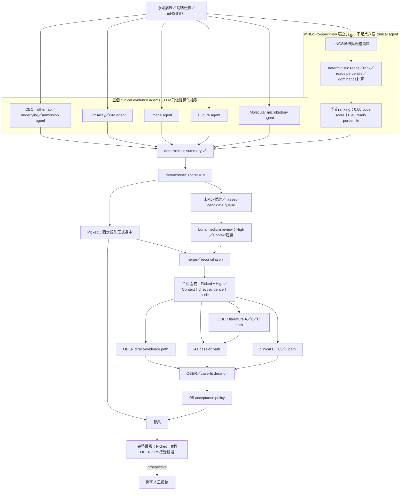

# KH 33 位完整舊版流程：deterministic Picked＋OBER／case-fit R5

狀態：**保存產物重建版**。本文件描述本次教授報告所稱的「完整舊版」，其最終陽性集合不是 A–G 消融組 A，而是：

> 舊 deterministic Picked（67 個）＋OBER／case-fit R5 接受新增（9 個）＝76 個完整舊版輸出。

以目前固定的 33 位病人、30 位有答案病人、60 個答案、strict identity matching 計算：TP 56、Precision 0.7368、Recall 0.9333、F1 0.8235。

## 1. 版本邊界

- Cohort：固定 33 位去識別化開發個案；公開 repository 不包含病例資料、答案或逐病人輸出。
- 上游保存設定：summary v3、deterministic scorer v19、mNGS ranking `0.60 × code score + 0.40 × reads percentile`、Luna medium missed-candidate review。
- 完整舊版終點：保存的 `picked_pathogens` 與 R5 接受新增的聯集。
- R5 是 recall-oriented development arm；它整合 direct evidence、case fit 與 clinical／literature 條件後，決定哪些 High／Context 候選加入完整舊版。
- 這不是 A–G 的 A。A–G 是為了拆解模組而刻意排除 OBER 的消融實驗。

## 2. 完整逐步流程圖

## 3. 每一步真正做什麼、產生什麼

| 階段 | 執行內容 | 判斷性質 | 主要產物 |
|---|---|---|---|
| 五個 clinical agents | 將 CBC／其他 lab／病史、FilmArray／GM、影像、培養、targeted molecular 整理成固定 JSON 欄位 | LLM／抽取；不直接決定最終病原 | 每位病人的 agent JSON |
| mNGS-to-specimen 獨立分支 | 整理候選菌、檢體、reads、rank、percentile、dominance | **deterministic**；不是 LLM | `mngs_candidate_microbes_ranked.json` 等 ranked artifacts |
| Summary v3 | 將五個 clinical agents 與 mNGS ranked evidence 合併成 scorer 可用的病人摘要 | deterministic | `NGS_patient_<id>_final_summary_with_filmarray_deterministic.json` |
| Scorer v19 | 依病原類型、宿主、檢體、院端支持與 mNGS 訊號產生 Picked 與待複核候選 | deterministic | `NGS_patient_<id>_mNGS_max_deterministic_groupmatch_speciesrep_20260813.json` |
| Luna missed-candidate review | 只複核 deterministic 未正式 Picked 的候選，給 High／Context 建議 | LLM review；不覆寫 Picked | `NGS_patient_<id>_mNGS_missed_candidate_review_..._20260813.json` |
| Merge／reconciliation | 保存 authoritative Picked；做 review tiering、非肺部來源 guardrail、syndrome／review convergence、菌名清理、alias／group reconciliation 與 audit routing | 程式化合併；**不是把兩個清單直接串起來** | `NGS_patient_<id>_mNGS_max_merged_..._20260813.json` 與後續 fullsync merged JSON |
| OBER evidence assembly | 同時看 merged Picked／direct evidence、literature A／B／C、A1 case fit、clinical B／C／D | 混合式證據審查 | `full_high_context_casefit_v1_20260819/p*_casefit.json` |
| R5 acceptance | `R0 OR C3 OR ((A1 strong>=2 OR A1 match>=7) AND site-aligned AND (B-absolute OR B-relative))` | 固定 acceptance arm；由保存 case-fit 結果計算 | `r5_selected_additions.csv`、`patient_database_index.csv` 的 `r5_*` 欄位 |
| 最終評估 | 將每位病人的 `r5_final_pathogens` 與固定答案做 strict matching | post-hoc；答案不回饋決策 | `kh_revised_benchmark_metrics.json` |

## 4. Merge 為什麼不是單純串接

Merge 必須解決五種衝突：

1. **Tier 衝突**：同一菌可能同時在 Picked、High、Context；Picked 保持 authoritative，其餘只保留審查層級與理由。
2. **來源 guardrail**：尿液、血液或其他非肺部訊號不能未經判斷直接當成肺炎病原證據。
3. **菌名 reconciliation**：舊名、別名、群組與 species member 必須合併，避免同一病原被重複計數。
4. **syndrome／review convergence**：病原、症候群和 reviewer 建議要在相同病人／相同肺炎事件下對齊。
5. **Audit routing**：無法確認 identity、來源或病因角色的候選保留稽核紀錄，但不能悄悄進入最終陽性集合。

因此流程圖與 Methods 不可寫成「Picked 清單加上 Luna／OBER 清單」；正確說法是「先 reconciliation，再由 OBER／R5 acceptance 決定新增」。

## 5. OBER／R5 的增量角色

在保存的開發 cohort 中，R5 在 deterministic Picked 之外接受 9 個額外候選，使完整舊版由 67 個 deterministic Picked 增加為 76 個輸出。公開文件只保留流程與聚合數字；逐病人候選、答案與 clinical evidence 不上傳 GitHub。

## 6. 可追溯性與公開界線

- 舊流程的程式入口、規則與無病例測試保存在 repository 根目錄既有的 legacy pipeline。
- 私有環境另保存上游 manifest、case-fit manifest、R5 patient index、答案契約與逐病人比較表。
- 上述私有產物含研究病例或答案資訊，不包含在公開 repository；Methods 中的聚合數字不能取代原始 private registry。
