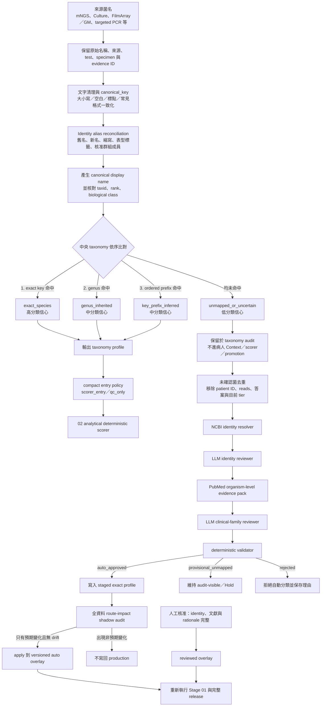
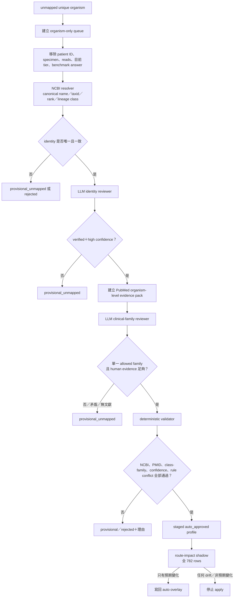

# KH 菌名標準化與中央 taxonomy 詳細流程（v2.6）

版本日期：2026-10-01

適用 release：`2026-10-01_KH_ablation_F_current_full_v1`

主流程位置：`01_compact_taxonomy`，之後才進入 `02_analytical_scorer`。

## 1. 這個模組到底負責什麼

菌種分類模組同時處理三件彼此不同的工作：

1. **Identity（身分）**：不同拼法、舊名、新名、縮寫或群組名稱是否指向同一個 taxon；其 canonical name、taxid 與 rank 是什麼。
2. **Clinical family（臨床規則群）**：該 taxon 應套用哪一類通用 guardrail，例如典型呼吸道病原、再活化病毒、口腔／吸入相關菌或環境低特異性菌。
3. **Routing（候選路由）**：已確認身分的資料可以進 scorer entry、只留 QC，或因 taxonomy 尚未確認而進 clinical review／audit。

它**不負責**直接判定某位病人是否真的被該菌感染，也不能只因某菌被分到「典型呼吸道病原」就直接變成 Picked。病人層級仍必須結合每個 test 的 QC、reads／rank／RPM、DNA／RNA 重現性、檢體、時間、病史與院端證據，由後面的 deterministic scorer、promotion 與 reporting 判斷。

## 2. Production 的完整大流程



目前未確認菌的 production 政策是：**來源證據與原始 reads 不刪除，audit 可見；但在 identity／family 尚未通過核准前，不進病人的 Context、scorer 或 promotion。**這是暫時凍結的安全決定，最終版本簽核時仍要重新確認。

## 3. 第一步：保留來源與名稱正規化

每筆來源先保留以下資訊，之後才做名稱合併：

- 原始 reported name；
- patient／episode／test／specimen；
- DNA 或 RNA；
- reads、rank、RPM、QC 與 evidence ID；
- 來源類型，例如 mNGS、culture 或院端 targeted assay；
- 原始 biological class 標籤（bacterium、virus、fungus 等）。

接著由 `pathogen_normalization` 建立：

- `display_name`：供人閱讀的名稱；
- `canonical_key`：供程式穩定比對的標準 key；
- `genus_name`：exact profile 不存在時，用來嘗試 genus rule。

此步只統一字串，不改變證據強度，也不會因為名稱看起來像答案就升級。

## 4. 第二步：identity alias 與群組名稱 reconciliation

Production alias 檔為 `rules/pathogen_aliases.json`。它的作用是避免同一個 taxon 因舊名、新名或縮寫而被當成兩隻菌。

| 類型 | 例子 | 正確效果 | 不允許的效果 |
|---|---|---|---|
| 舊名／新名 | `Candida parapsilosis` ↔ `Lodderomyces parapsilosis`，taxid 5480 | 合併 identity 與 taxid | 不會因改名自動改成 Picked |
| 屬名更新 | `Pseudomonas alcaligenes` ↔ `Aquipseudomonas alcaligenes`，taxid 43263 | 指向同一 taxon | 不自行改變臨床證據 |
| 同物異名 | `Metamycoplasma salivarium` ↔ `Mycoplasma salivarium` | 避免重複候選 | 不補造不存在的 exact test |
| 常見縮寫 | PJP／舊稱 `Pneumocystis carinii` → `Pneumocystis jirovecii` | 統一 identity | PJP 仍須通過其 family-specific 規則 |
| 抗藥表型標籤 | MRSA、CRKP、VRE | identity 對應至物種；表型另存 | 表型標籤不等於新的菌種 |
| broad group | `K. pneumoniae group`、`A. baumannii complex`、parainfluenza group | 只在核准 member policy 內建立 group-member 支持 | broad assay 不冒充 exact species／subtype confirmation |
| 無法定種標籤 | `Yeast`、`G(-) bacilli` | 保留為 broad evidence label | 不強行轉成某個 exact species |

Identity alias 的核心原則是：**可以證明「是不是同一個名稱實體」，不能證明「是不是這次肺炎病原」。**

## 5. 第三步：中央 taxonomy 的固定比對順序

`tools/organism_taxonomy_classifier.py` 對每個 canonical name 使用固定、互斥的優先順序：

```text
exact species profile
    ↓ 未命中
genus profile
    ↓ 未命中
ordered key-prefix profile
    ↓ 未命中
unmapped_or_uncertain
```

| Mapping status | 如何命中 | 信心 | 可做什麼 | 不能做什麼 |
|---|---|---|---|---|
| `exact_species` | canonical key 存在 exact profile | High | 使用該物種的 taxid、rank、family 與 traits | taxonomy 本身不能直接 Picked |
| `genus_inherited` | 無 exact，但 genus 有規則 | Medium | 套用屬層級通用 family；保留 species identity caution | 不能假裝已有物種專屬臨床證據 |
| `key_prefix_inferred` | 無 exact／genus，但命中有順序的 prefix | Medium | 處理病毒群、未定種 sequence label 等可重用群組 | prefix 不等於 exact identity |
| `unmapped` | 三層皆未命中 | Low | 保存來源並送 review queue | 目前不進病人 Context／scorer／promotion |

Prefix 規則是有順序的，因此只採用第一個命中的 profile，避免同一名稱同時被多個模糊規則任意覆蓋。

## 6. 第四步：規則檔與覆蓋優先序

Production 不是只讀單一 taxonomy JSON，而是按以下順序合併：

1. `rules/organism_taxonomy_rules.json`：中央 base rules；
2. `rules/organism_taxonomy_gap_resolution_v1.json`：早期 gap-resolution overlay；
3. `rules/organism_taxonomy_auto_v1.json`：通過雙 reviewer 與 deterministic validator 的自動核准 exact profiles；
4. `rules/organism_taxonomy_reviewed_v1.json`：有完整人工核准證據的 reviewed profiles。

後載入的 overlay 對相同 exact／genus key 具有較高優先序；因此 reviewed overlay 最高。各檔目前的結構規模如下：

| 檔案 | Families | Exact profiles | Genus profiles | Prefix profiles |
|---|---:|---:|---:|---:|
| base | 12 | 25 | 41 | 4 |
| gap-resolution overlay | 新增 1 | 20 | 49 | 1 |
| auto overlay | 0 | 32 | 0 | 0 |
| reviewed overlay | 0 | 7 | 0 | 0 |

上述數量是檔案內容數，不等於 cohort 中命中的唯一菌名數；不同檔案可能對同一 key 提供較新版本。正式 release 以 `run_manifest.json` 記錄的路徑與 SHA-256 為準，不能把不同日期的 overlay 混用。

current F manifest 中的 taxonomy 元件 hash：

| Role | SHA-256 |
|---|---|
| production identity aliases | `d275a7cf39744cbfcf55444192b44c486621a7ddffd94f8ac1e08d67f6b224b0` |
| central taxonomy base | `be5801bf9108ea388bc17faf516dd4148bcb4a9975148b55be2b5a44879d999f` |
| gap-resolution overlay | `f60b9b1505214b0f43477e5445d1382e08b5de0bad592ee9b15d57655cd12356` |
| auto overlay | `571aa2c2047fcfb67e0735e9f7c5ba8a54fe9cd0a337c876f1f5041d4fdc8ec7` |
| reviewed overlay | `9052674b1edbd1e500fc21c7f3e7394e11b81fd098e9b09d8159f72286e71c43` |

## 7. 第五步：taxonomy profile 輸出欄位

每個名稱完成分類後，至少輸出：

| 欄位 | 意義 |
|---|---|
| `input_name` | 原始送入 classifier 的名稱 |
| `display_name` | 正規化後供人閱讀的名稱 |
| `canonical_key` | 穩定的程式比對 key |
| `taxid` | effective NCBI taxid；若不能安全確認則不得猜測 |
| `taxonomic_rank` | species、genus、group、unclassified label 等 |
| `biological_class` | bacterium／virus／fungus 等 |
| `biological_class_conflict` | 來源 class 與規則 class 是否矛盾 |
| `primary_rule_family` | 主要臨床 family |
| `secondary_rule_families` | 其他需要同時保留的 caution family |
| `clinical_traits` | colonization、reactivation、host-risk、direct-support 等通用特徵 |
| `mapping_status` | exact／genus／prefix／unmapped |
| `classification_confidence` | high／medium／low |
| `rule_source` | 命中 exact、genus、prefix 或 fallback 的來源 |
| `matched_rule_ids` | 實際命中的版本化規則 ID |
| `needs_literature_review` | 是否需要文獻覆核 |
| `routing_only` | 明示 taxonomy 只做 routing，不是病人因果判定 |

若規則檔出現 benchmark answer、ground truth 或 `is_answer` 等答案衍生欄位，classifier 會直接拒絕載入，防止把答案偷寫進 taxonomy。

## 8. 第六步：十三個 clinical rule families

Family 的目的不是替病人下診斷，而是告訴下游 scorer：這類菌需要什麼支持、有哪些常見陷阱。

| Family | 主要意義 | 下游重點 |
|---|---|---|
| `typical_respiratory_pathogen` | 常見或已知呼吸道病原 | 仍看檢體、事件、強度與 direct evidence；不能只靠 family Picked |
| `hospital_or_nonfermenter_gnb` | 院內感染／非發酵 GNB 類 | 同時考慮 HAP、device、定植與抗藥背景 |
| `high_consequence_opportunistic` | 漏掉後果高或高度依賴宿主風險的病原 | 需要 family-specific host／targeted／影像或其他三角驗證；generic 免疫低下不能單獨 Picked |
| `mold_or_opportunistic_fungus` | 黴菌與非 Candida 機會性真菌 | 宿主風險、侵入性證據、組織／培養／相符影像較重要 |
| `candida_or_yeast` | Candida 與其他酵母菌 | 呼吸道定植常見；species identity、sterile-site／blood 與 invasive evidence 重要 |
| `herpes_or_reactivation_virus` | 可能再活化或脫落的病毒 | 區分 current disease、reactivation、shedding；缺 viral load 不當陰性，但不能靠單次弱訊號 Picked |
| `oral_aspiration_or_anaerobe` | 口腔菌、厭氧菌與吸入型態相關菌 | 看 aspiration 病史、多菌型態、下呼吸道相容性與重現性 |
| `skin_airway_colonizer_prone` | 皮膚／氣道常見定植或污染傾向菌 | 強調 exact identity、重複或跨部位支持、無菌部位證據與污染 caution |
| `environmental_low_specificity` | 水、土壤、植物或環境相關、肺部特異性低 | 不因多次 technical repeat 自動當獨立生物證據；偏好 direct clinical support |
| `gi_urinary_or_nonpulmonary_prone` | 常見來源偏腸胃、泌尿或其他非肺部部位 | 必須證明肺部檢體／事件相容；尿液陽性不可直接當肺炎證據 |
| `other_respiratory_virus` | 其他已知呼吸道病毒 | RNA test、exact member、呼吸道 panel 與事件相符性重要 |
| `commensal_virome_or_endogenous_element` | 常見 virome、內源性元素或因果未成立的病毒序列 | 通常只留背景／audit；不得由 taxonomy 自動升級 |
| `unmapped_or_uncertain` | 身分或臨床 family 尚未安全確認 | `taxonomy_review_required`；目前不進病人 Context／scorer／promotion |

同一 taxon 可以有一個 primary family 與多個 secondary families。例如某菌可以主要屬於環境低特異性，但仍附帶 opportunistic fungus caution；下游不應只看 primary family 而忽略 secondary cautions。

## 9. 第七步：從 taxonomy profile 到 candidate routing

`build_compact_multi_assay_entry_shadow.py` 對每個 case-organism：

1. 呼叫 `classify_organism()` 取得 taxonomy profile；
2. 將原始 per-test evidence 與 profile 一起送進 `route_candidate()`；
3. 依固定 entry policy 分成：
   - `scorer_entry`：具可評估的陽性證據，送往 Stage 02；
   - `qc_only`：只足以保存 QC／來源資訊，不當陽性候選；
   - `clinical_review`：主要是 taxonomy 尚未核准，留在 review／audit。

current F 的實際 Stage 01 結果：

| 項目 | 數量 |
|---|---:|
| 病人 | 33 |
| DNA／RNA tests | 117 |
| case-organism rows | 782 |
| positive observations | 1,898 |
| selected positive observations | 1,267 |
| filtered positive observations | 631 |
| `scorer_entry` | 444 |
| `qc_only` | 252 |
| `clinical_review` | 86 |

三個 route 相加為 782，沒有候選憑空消失。Stage 01 子工具名稱仍保留歷史上的 `shadow`，但 current F 的 integrated runner 會正式讀取它的輸出並送入 Stage 02；是否為 production release 由外層 manifest 與完整 runner 決定，不由子工具檔名決定。

## 10. 未確認菌的 LLM 流程



### LLM 能做的事

- Identity reviewer：核對 reported name、NCBI canonical name、taxid、rank、lineage-derived class 是否一致。
- Clinical-family reviewer：只根據已驗證 identity 與提供的 PubMed 文獻，提出可重用的 organism-level family 草稿。
- 兩個 reviewer 都可以拒絕判斷，輸出 `provisional_unmapped`。

### LLM 不能做的事

- 看病人編號、該病人的 reads、檢體、現有 Picked／High 或 benchmark answer；
- 判斷某位病人是否感染；
- 產生 Picked／Possible；
- 自己把 profile 寫進 production；
- 因只有一篇 case report 就宣稱該菌是一般肺炎病原。

### Deterministic validator 必須確認

- NCBI resolution 唯一、taxid 為正值、rank 與 canonical name 合理；
- biological class 可由 lineage 驗證，且無來源 class conflict；
- identity reviewer 為 verified／high confidence；
- clinical family 在 allowed set 內，且 class-family 相容；
- 支持文獻 PMID 可追溯，證據強度與信心達門檻；
- 不覆寫既有 base／human-reviewed exact profile；
- 套用後 route-impact audit 沒有非預期變化。

## 11. 目前未確認菌的實際進度

初始 current queue 有 107 個 patient-case rows，去重後是 97 個名稱：

- NCBI identity：96 個 `exact_scientific_name`、1 個 `single_ncbi_match`；
- PubMed pack：77 個至少有一篇文章，20 個沒有可用文章；沒有文章不會被強迫分類；
- 雙 reviewer：97/97 完成、0 failures；
- 21 個 `auto_approved`，已通過 alias-aware route-impact audit並寫入 auto overlay；
- 76 個 `provisional_unmapped`，對應 86 個 patient-case rows，目前仍為 `clinical_review`／audit-visible。

這 76 個 provisional 名稱的來源資料沒有被刪除；只是尚未具備足夠資格進入病人 Context 或陽性 scorer。最終版本簽核時必須再次提出以下選擇：

1. 維持 audit-only；或
2. 允許 Patient-Context-visible，但必須加上永久 promotion blocker，且重跑 candidate count、病人結果與報告。

目前凍結政策為第 1 種。

## 12. 如何讀懂兩組 taxonomy 數字

既有文件中會看到兩種統計，分母不同，不應直接混算：

- 404-key taxonomy replay：57 exact、200 genus、50 prefix、97 unmapped；用於檢查 canonical mapping、effective taxid 與 drift，總和 404。
- 97-name LLM review disposition：21 auto-approved、76 provisional；用於決定哪些未確認名稱可寫入 auto overlay。

Production 是否真的進 scorer 應看 current F Stage 01 的 route 結果：444 `scorer_entry`、252 `qc_only`、86 `clinical_review`，以及 manifest 所記錄的 overlay hashes。不能只把 97−21 當作另一份 replay 的即時 mapping count。

v2.6 taxonomy 端到端 replay 結果為：

- family drift：0；
- mapping-status drift：0；
- canonical collision：0；
- 必要 assertions：9/9 通過。

## 13. Taxonomy 如何影響後面的 scorer

Taxonomy 會影響：

- 候選能否從 Stage 01 進入 scorer；
- 套用哪一組 family-specific caution／blocker；
- 某些 direct evidence 是否必須 exact species 才有效；
- broad group evidence 能否只作 group support，而非 exact confirmation；
- Candida、colonizer-prone、environmental、reactivation virus、PJP 等路徑需要哪些額外證據；
- 最終 audit reason 顯示什麼 identity／family 來源。

Taxonomy 不會單獨做到：

- 增加 reads、RPM 或 rank；
- 把 technical repeat 變成獨立生物重現；
- 把 hospital broad label 當 exact species；
- 讓 Context／High 直接升 Picked；
- 讓缺少的 PCR／culture 被視為陰性；
- 依 benchmark answer 調整 family。

## 14. 防止 overfitting 的設計

此模組目前使用以下保護：

1. taxonomy 規則檔禁止答案衍生欄位；
2. LLM queue 不含 patient ID、reads、specimen、tier 或答案；
3. family 規則是跨病人可重用規則，不寫 `Pxx＋某菌` 的單病例例外；
4. LLM 只產生草稿，deterministic validator 與 route-impact audit 才能核准；
5. provisional／rejected 項目不會為了提高 cohort F1 被硬塞進 scorer；
6. alias 只修 identity，不修改 clinical tier；
7. 每次 release 凍結所有規則檔與 SHA-256；
8. benchmark 評估在 decision freeze 後才執行；
9. taxonomy change 必須檢查全體 route changes、candidate disappearance、family drift 與 canonical collision；
10. 即使 auto-approved profile 讓內部 cohort 指標下降，也保留真實結果，不因答案不漂亮而撤回 identity 規則。

仍需注意：目前 clinical-family 規則與門檻是在 33 位 development cohort 的長期覆核中建立，外部 transportability 尚未由相容 cohort 完成驗證。因此 v2.6 是可追溯的研究候選，不應僅憑內部 F1 宣稱已臨床驗證。

## 15. 主要程式、規則與產物

### Production 程式與規則

- classifier：`tools/organism_taxonomy_classifier.py`
- normalization／alias：`tools/pathogen_normalization.py`、`rules/pathogen_aliases.json`
- compact routing：`tools/build_compact_multi_assay_entry_shadow.py`
- base taxonomy：`rules/organism_taxonomy_rules.json`
- gap overlay：`rules/organism_taxonomy_gap_resolution_v1.json`
- auto overlay：`rules/organism_taxonomy_auto_v1.json`
- human-reviewed overlay：`rules/organism_taxonomy_reviewed_v1.json`
- LLM two-reviewer gate：`tools/auto_decide_organism_taxonomy.py`
- human approval：`tools/approve_organism_taxonomy_reviews.py`
- integrated runner／manifest：`tools/run_kh_integrated_release_v2.py`

### current F 產物

- manifest：`outputs/runs/2026-10-01_KH_ablation_F_current_full_v1/run_manifest.json`
- Stage 01 summary：`01_compact_taxonomy/summary.json`
- 全部 decision rows：`01_compact_taxonomy/all_decisions.csv`
- 未確認菌 NCBI／literature queue：`outputs/runs/2026-09-30_KH_taxonomy_llm_review_queue_v2_4_ncbi/`
- LLM decisions：`outputs/runs/2026-09-24_KH_taxonomy_auto_decision_v1/decisions/`

以上是 private run 的產物契約。公開 repository 不包含 organism review queue、文獻包、模型 prompts／raw responses 或逐病人 decision rows；重跑時由使用者在自己的私有 output root 產生。

## 16. 一句話版

> 新版先把菌名與 taxid 對準，再用 exact／genus／prefix 分到可重用的 clinical family；未確認菌交給不看病人答案的雙 LLM 產生草稿，只有通過 deterministic validator 與全資料 route-impact audit 的 profile 才能寫回正式 overlay。Taxonomy 只決定「套哪組規則、能否進 scorer」，不直接決定病人是否感染或是否 Picked。
