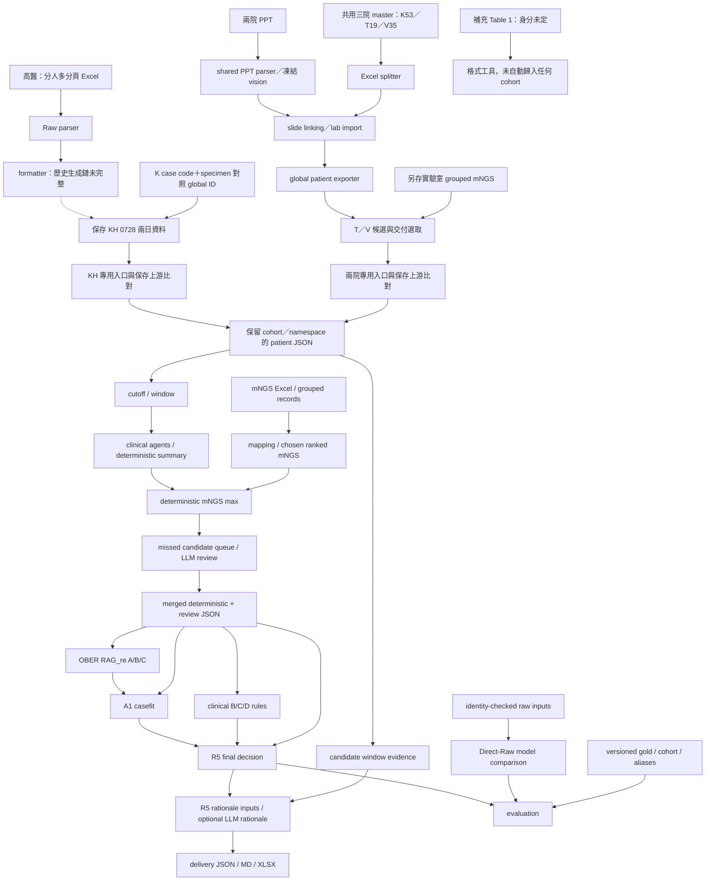

# 實際研究流程與程式

> 前端已改按高醫KH與兩院分線。KH保存輸入297份、兩院保存輸入480份與對應上游相同；原107筆master重播屬格式層驗證，不代表兩條原始資料鏈均已重建。入口、身分規則與尚缺材料見 [FRONTEND.md](FRONTEND.md)。

> 2026-09-18更新：已還原並驗證v19 scorer，保存summary＋ranked起算55/55完整內容相同；請用 `scripts/replay_v19_upstream.py`。v20 計分規則保留，共用 model-free helper 已與退役的 LLM mNGS-max 分支解耦。raw→summary不是完整重現。方法見 [版本恢復與操作](UPSTREAM_RECOVERY.md)。

> 現行主線固定使用 with-FilmArray：`analyze_llm_agent.py` 與 `summarize_agent.py` 各只產生一套包含 FilmArray/GM 的輸出，v20 `--summary-mode` 只接受 `deterministic` 或 `full`，且預設為 `deterministic`。no-FilmArray 僅保留於歷史 recovered／reference 程式。
以下依 import、CLI、JSON 欄位與保存 artifact 重建。檔名中 `latest`、日期與修改時間不構成正式版本證據。路徑均相對本 repo；完整逐檔入口、函式與 import 見 `CODE_CATALOG.csv`。



## 1. 先分高醫與兩院，再選格式工具

高醫專用入口是 `frontend/kh/run.py`，兩院是 `frontend/two_hospital/run.py`；兩者目前從保存臨床／mNGS起算，不宣稱重生模型輸出。KH33、兩院48是本次來源範圍，55例交付是KH30＋兩院25。兩院25例summary實際來自rich/moderate20例＋完整root5例，不能直接選整個27例root替代。

詳見 [高醫主線](../frontend/kh/README.md)、[兩院主線](../frontend/two_hospital/README.md)。以下是主線內可用的**格式工具**，不是三條獨立研究cohort。


| 路徑／分支 | 程式 | 輸入 → 輸出與證據 |
|---|---|---|
| `upstream/` 的舊多分頁入口 | `core/main.py`, `core/raw_parser.py`, `parsers/*.py`, `core/llm_parser.py` | Excel → `*_json_Raw/*_Raw.json` → `NGS_patient_*_json/*_{section}.json`。main 只串重複檢查、Raw、formatter，不是整個研究流程。formatter 需要 API 與 `prompts/`，現行上游此目錄缺失。 |
| `reference_versions/shared_upstream/` 的 master Excel 分支 | `tools/split_excel_master_by_patient.py`, `tools/time_window.py` | BASIC/MICRO/MNGS/READ 等 master 表 → case key 目錄、各類 clinical JSON、patient manifest/index。不能假設其 case index 等於其他資料集的 patient number。 |
| 同一 shared 分支的 PPT 補入 | `ppt_patient_parser/cli.py` 及該 package；`tools/link_ppt_slides_to_excel_patients.py`, `tools/import_ppt_labs_to_patient_exports.py` | PPT 文字／影像 → `parsed.json` → 依病人、日期與檔案線索連到 Excel case → 影像、CBC／其他 lab 更新。vision 是選配付費流程。匯入器會修改指定的 patient export 目錄。 |
| shared 格式銜接 | `tools/export_legacy_patient_json.py` | case key exports → `NGS_patient_<n>_json`、標準 section JSON、`mNGS_grouped`、`legacy_patient_index.json`；index 是跨資料集 identity 銜接必需品。 |
| 單頁 Table 1 分支 | `tools/parse_table1_workbook.py`, `tools/parse_table1_standardized.py`, `tools/table1_sections.py`, `tools/table1_standardizer_engine.py`（均在 shared） | 同一 Excel 可走 Raw 分段或直接 deterministic standardized export，兩者不是必然的前後步驟。`--baseline-dir` 可合併既有 demographics／診斷／mNGS；輸出與不使用 baseline 時不同。 |

現行 `upstream/ppt_patient_parser` 只存 slide text／images；shared 版本有 downstream linker 所需的 `parsed.json`／vision 流程。不可拿現行上游 PPT 輸出去接 shared linker，就宣稱流程完整。

## 2. 上游臨床與 mNGS 處理

現行純 deterministic 主線已有單一入口 `run_deterministic_v20.py`。它從標準化病人 JSON 起算，在全新輸出目錄中依序執行 ranked mNGS、with-FilmArray deterministic summary 與 v20 scorer，最後產生合併的 `final_results.json` 和具輸入／輸出 SHA256 的 `run_manifest.json`。入口不呼叫 LLM／網路，也不包含需要額外 casefit、文獻與 clinical config 的 OBER R5。

需要一路跑到流程圖最末端時，根目錄另有 `run_full_pipeline.py`。它依本頁主線呼叫既有 stage 程式、建立必要 handoff 目錄／delivery config，最後執行 delivery audit；不把選菌或 R5 規則重寫進 main。先用 `--plan` 可無副作用列出完整 input/output/command。詳見 [完整編排入口](FULL_PIPELINE.md)。

```powershell
python -B run_deterministic_v20.py `
  --input-root examples/frontend/cohorts/two_hospital `
  --output-root local_outputs/deterministic_v20_demo_001
```

下表的上游程式相對 `upstream/`；`scripts/` 入口則相對 repo 根目錄。這些是不同可組合路徑，並非每次實驗都依序執行全部程式。

| 階段 | 程式 | 主要介面與分支 |
|---|---|---|
| deterministic v20 單一入口 | 根目錄 `run_deterministic_v20.py` → `tools/run_deterministic_v20_pipeline.py` | 標準化病人 JSON → ranked mNGS → with-FilmArray deterministic summary → v20 最終選菌；接受 flat 或 per-patient 目錄，自動建立 `agent_outputs/`，拒絕覆寫與 mNGS 來源歧義。 |
| 時間 cutoff | `tools/build_patient_cutoffs_from_mngs.py`, `tools/filter_patient_info_by_cutoff.py`, `tools/filter_mngs_by_cutoff.py` | mNGS 時間錨點／cutoff → 篩選後 clinical 與 mNGS；clinical filter 依 `collected_time`，缺失與無法解析的時間可能遭排除。 |
| 臨床分項分析 | `tools/analyze_llm_agent.py`, `agents/prompts/` | CBC／host、culture、filmarray／GM、image、molecular 等 JSON → `agent_outputs/`；使用 LLM。 |
| clinical summary | `core/summarize_agent.py` 或 `tools/build_deterministic_summary.py` | agent outputs → `summary_outputs/*final_summary*.json`；前者 LLM、後者規則。`normalized_agent_fallback.py` 可從 normalized JSON 補缺；當前 `evidence_preservation.py`、`source_provenance.py` 是新版資料保留／追溯邏輯。 |
| 候選整理與檢體映射 | `extract_mngs_candidate_microbes.py`, `build_mNGS_data_mapping.py`, `build_mngs_grouped_from_excel.py` | Excel、CaseReview、specimen／identity 對照及可選 culture → 候選、grouped／mapping；不是只靠 JSON 檔名配病人。 |
| mNGS ranked / chosen | `rank_mngs_candidate_microbes.py`, `build_ranked_mngs_from_grouped_folder.py`, `run_mngs_to_specimen_agent.py` 或 `run_mngs_to_specimen_v4_deterministic.py`, `build_chosen_ranked_mngs_from_*.py` | grouped／mapping／候選 → specimen 歸屬與 chosen ranked JSON；LLM 與 deterministic 為替代分支。各 split 工具保留分人格式。 |
| 上游最終選菌 | v19重播：`tools/deterministic_mngs_max_scorer_v19_recovered.py`（入口 `scripts/replay_v19_upstream.py`）；現況v20：`tools/deterministic_mngs_max_scorer.py` | patient dir、ranked mNGS、clinical final summary → `best_available_summary.picked_pathogens`, `pathogen_candidates` 等。包含 reads／dominance／site／host、hospital-only、去重及 guardrail。 |
| 補漏 review | `build_missed_candidate_review_queue.py`, `review_missed_mngs_candidates.py`, `merge_deterministic_max_with_missed_review.py` | scored JSON → review queue → LLM review tiers → merged JSON。OBER 使用 picked、high_priority、context_needed；low_specificity／omitted 留作追溯。 |
| 上游開發與比較 | `run_mngs_to_specimen_full_pipeline.py`, `optimize_*`, `compare_*`, `audit_*`, `recalculate_kh_benchmark_metrics.py` | 部分 optimize 程式以答案調參；不可當 untouched test inference。full pipeline 的 raw／optimized 預設輸出路徑可能相同，使用前需明訂新目錄。 |

另有 `build_rag_v2_inputs.py → retrieve_rag_v2_pubmed.py → build_rag_v2_adjudication_packets.py → adjudicate_rag_v2_packets.py → evaluate_rag_v2_calibration.py`，是上游自己的 RAG v2 分支，不等同下節的 OBER R5。

## 3. OBER 與 R5

| 階段 | 程式 | 行為 |
|---|---|---|
| earlier RAG（私人封存，不在此repo） | 原 `RAG/RAG/` 的 `run_casecard_cli.py`, `casecard_parser_v3.py`, `rag_engine_v3.py`, `pubmed_client.py`, `kb_index.py`, `schemas_v3.py` | 僅記錄方法演進；舊程式已移出公開候選，OBER R5 不依賴這套引擎。 |
| OBER baseline | `RAG_re/rag_re/input_adapter.py`, `engine.py`, `rules.py`, `judge.py`, `pubmed.py` | 解包 merged JSON、保留 E0 picked，A 文獻、B mNGS、C 院內證據。`--skip-literature` 僅供無文獻運算，不能假稱得到相同完整 A 結果。 |
| clinical B/C/D | `RAG_re_clinical/rag_re_clinical/clinical_rules.py` 及 CLI | clinical feature → B 強度軸／B_STRICT、C grade、D state。clinical replay 也有研究對照 arms。 |
| A1 casefit | `RAG_re_casefit/rag_re_casefit/case_card.py`, `judge.py`, `rules.py`, `batch.py` 等 | latest merge 與 frozen RAG 文獻 → 逐篇 casefit strong／partial／mismatch／insufficient → 計數。prompt 排除 gold、picked、reads、culture/PCR 與 review rationale 等來源。 |
| R5 最終決策 | `OBER_patient_delivery/generate_r5_final_decisions.py` | 直接依 merged picked、casefit 與 clinical rules 決策；不需要先執行 pruning／abc。輸出所有候選處置、selected、rule path、source SHA256、manifest。 |

R5 程式中的精確公式：

```text
picked OR C3 OR ((A1_strong >= 2 OR A1_match >= 7)
                AND site_aligned AND (B_absolute_axis OR B_relative_axis))
A1_match = strong + partial
```

Picked 原順位不可變；補入者接續排序。補入的字母順序不代表臨床信心。B 是任一軸成立，不是 B_STRICT 的雙軸同時成立；D 在此不是隱藏必要 gate。`evaluate_r5()` 處理補漏訊號；完整 picked union 在 `compose_decision()`。

**A1 batch 並非保證離線。** 程式找不到 frozen candidate／articles 時，會 fallback 到 PubMed 與 ArticleJudge，再呼叫 CaseFitJudge。原 README 的「不新增搜尋」描述與此行為有落差。本次只驗證保存 artifact 與確定性重播。

## 4. 證據、理由、交付與評估

| 階段 | 程式 | 介面 |
|---|---|---|
| 病例內證據 | `mngs_candidate_evidence_pipeline_20260902/mngs_candidate_evidence_pipeline/` 的 `extract_selected_pathogens.py`, `build_candidate_window_evidence.py`, `build_mngs_window_plus_candidate_evidence.py`, `split_candidate_evidence_by_test.py`, `build_rationale_views.py`；入口 `run_pipeline.py` | structured patient JSON＋mNGS／凍結選菌 → candidate evidence、全時間候選證據、時間窗完整病例、理由 views。此階段與 upstream cutoff 的時間欄位優先序不同。 |
| 可讀理由 | 同 package 的 `generate_llm_rationales.py`, `audit_llm_rationale_batch.py` | evidence/views → LLM 理由 → audit。選菌／排序不得由理由生成器重新決定。 |
| R5 對齊 | `OBER_patient_delivery/prepare_r5_rationale_inputs.py`, `assemble_r5_rationales.py` | 更新 selected 為 R5 決策後再產生／組裝理由，避免沿用僅 upstream picked 的舊理由。 |
| 交付 | `delivery_model.mjs`, `export_delivery.mjs`, `workbooks.mjs`, `audit_delivery.mjs` | frozen decision＋rationale＋evidence → 簡表／traceable JSON/MD/XLSX。XLSX 需另解決 artifact-tool 依賴。 |
| Direct-Raw | `LLM_test/direct_raw_benchmark/direct_raw_runner.py`, `input_identity.py`, `astra_batch.py` | identity-checked raw mNGS＋clinical → 去識別模型 payload → frozen prediction。執行模型需付費 API。identity mapping 修正會改變輸入，不可直接混用舊 prediction cache。 |
| 結果評估 | `evaluate_direct_raw.py`, `evaluate_astra_benchmark.py`, `rescore_gold_corrections_20260912.py`；各 OBER package evaluation 模組 | prediction／decision＋cohort＋版本化 gold／aliases → TP/FP/FN、precision/recall/F1、per-patient。gold 僅在評估路徑，不進 R5 finalizer。 |

`RAG_re_clinical_pruning`／`RAG_re_clinical_pruning_abc`、早期 `result_summaries`、`chung_test` 均保留作方法與版本比較，不畫成主線中每次都必須執行的步驟。
